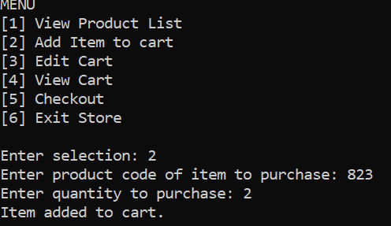
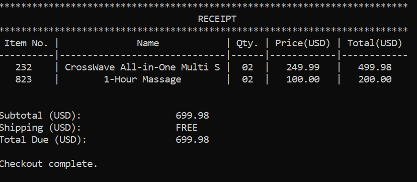

# Store Project

In this project you will be creating a store and shopping cart. The store sells two types of products: physical and digital products. Digital product is a derived class of physical products. Users of the program will be able to add items to their cart, remove items, and edit the purchase quantity. They will also be able to view their cart and checkout. 

## Dimensions Class
The Dimensions class is used to store the dimensions of a physical item. It stores the length, width, and height of items as a double. It also stores the measurement as a DimensionClass object (centimeters or inches). DimensionClass is an enumeration type provided.
The class must contain a default constructor and a constructor that accepts a value for each data member. Create accessor and mutator methods for each data member. Also include a method named getDimensions which returns the dimensions as a string in the format "L X W X H in/cm".

## Manufacturer Class
The Manufacturer class stores information on the manufacturer of the items. It stores the name, address, and phone number. 
This class contains 3 constructors: (1) the default constructor, (2) a constructor that accepts the name, and (3) a constructor that accepts a value for each data member. Create the appropriate accessor and mutator methods, and a print method.

## Product Class
The Product class stores information relevant to a product. These include product ID (integer), name, description, model (string), price, quantity, UPC (string), product dimensions (Dimensions object), and brand (Manufacturer object). Brand should be declared as a constant. Also include a static variable productCount. Each time a product is created, the product count should increase by 1.
The Product class should have 3 constructors: (1) a default constructor; (2) a constructor that accepts the product ID, name, description, price, quantity, upc, dimensions and manufacturer, (3) a constructor that accepts the product ID, name, description, model, price, quantity, upc, dimensions and manufacturer.
Create accessor and mutator functions for each of the data members. Also create the following functions: printManufacturerDetails, printProduct, printShortProduct, sellItem, returnItem and getProductCount. The table below describes each function. Use the template file from the repository.

|Function|Description|
|---|---|
|printManufacturerDetails|	Prints all the details of the manufacturer
|printProduct|	Prints all the product details
|printShortProduc|t	Prints the short version of the product. Product ID, Name, Manufacturer name, and price should be displayed
|sellItem|	Selling an item reduces it quantity. This function should return true or false if the sale was successful
|returnItem|	Returning an item increases the quantity of an item.
|getProductCount|	Returns the value of the static member variable

## Digital Product Class
The Digital Product class inherits from Product. A digital product has the following attributes: downloadable (bool), file (string), allowed downloads (integer), number of days (integer) and service terms (string). The allowed downloads are the number of downloads allowed after purchasing the product. The number of days is the number of days after purchase that the owner has to download the product. If the value is unlimited, it should be set to -1. Create accessor and mutator functions for each data member.
This class has 2 constructors: (1) default (2) the appropriate overloaded constructor. Override the printProduct function to print the appropriate digital product details.

## Shopped Item
The Shopped Item class has 2 data members: item (Product) and quantity (integer). This class should have accessor and mutator methods for each. Also create 2 constructors.

## Store (Main)
When the program begins, read the product data from the provided CSV file products.dat. The file format is as follows:
|Field|	Description|
|---|---|
|Regular Product/Digital Product|	0 – if regular product 1 – if digital product
|Product ID|	A 3 digit number for the product ID. Numbers less than 700 are regular products
|Name|	Product name
|Description|	Product description
|Model Number †|	Product model number
|Unit Price|	Price per unit
|Quantity in Stock|	Quantity of the product in stock
|UPC|	Universal product code
|Length|	Length of the product
|Width|	Width of the product
|Height|	Height of the product
|Measurement Type|	0 – centimeters 1 – inches 
|Manufacturer Name|	Name of the manufacturer
|Manufacturer Address|	Address of the manufacturer
|Manufacturer Phone|	Telephone number of the manufacturer
|* Is Downloadable| 	0 – if not downloadable 1 – if downloadable
|* File name †|	Name of the downloadable file
|* Number of allowed Downloads †|	Number of times the user is allowed to download the file
|* Number of Days †|	Number of days the user has to download the product
|* Service Terms|	Terms and conditions of the digital product

*Digital products only
†Optional. Does not appear in every entry

Driver file (Store.cpp) should allow the user to complete the following actions:

```
[1] View Product List – View the list of all products
[2] Add Item to cart – Allow the user to an item the cart (vector of ShoppedItems)
[3] Edit Cart – Allow users to remove an item or edit the item quantity
[4] View Cart – View all items in the cart. Use the printShortProduct
[5] Checkout – Display the user receipt. (Example below)
[6] Exit Store
```

Write a function for each of the first 5 actions. For purchases less than $75, charge the uses a $5.99 shipping fee, otherwise it is free. The program must validate all user input.



 

## Documentation Requirements

Be sure your code can compile and run in Codio. The documentation must include the follow:

1. Cover Page (provided; fill in all information; each page should have the same header/footer)
1. Table of Contents
1. Statement of Independent Effort
1. Grade Sheet (last pages of document)
1. Class Diagram
1. IPO Tables (1 per function)
1. Flowcharts (1 per function, not including accessors and mutators)
1. The code
    * Well commented code
    * The top of each file should include:
        - Name of the file
        - Group number and member names
        - Date last edited
        - Purpose of the program

**Note: Your number of relevant commits to the repository will affect your grade.**

### Example function header comments

```
	/**
	* @brief This function sets the value of all private variables.
	* @param year This is the year
	* @param month This is the month of the year
	* @param day This is the day of the month
	* @param hour This is the hour
	* @param minutes this is the number of minutes
	* @return Nothing.
	*/
	void setDateTime(int, int, int, int, int);

	/**
	* @brief This function creates a date/time string of the current DateTime object.
	* @param format This value indicate what date/time format to get
	* @param longForm This is a true/false value to determine whether to show 
	* a month number or month name. True displays month name.
	* @return string This returns the date/time string
	*/
	std::string getDateTime(int,bool) const;
```

### License

